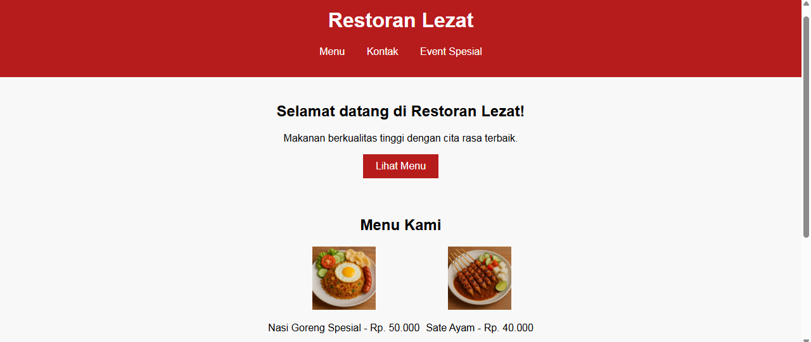

# 🍽️ Restaurant Website

Website modern dan responsif untuk restoran dengan tampilan profesional, cocok untuk promosi online restoran, kafe, atau warung makan.

## 🍜 Fitur Utama

- 🌟 Landing page restoran yang menarik
- 📋 Menu makanan dan minuman
- 📞 Halaman kontak dan reservasi
- 📷 Galeri foto makanan (misalnya: nasi goreng, sate ayam, dll.)
- 📱 Desain responsif dan ramah pengguna

## 🔥 Preview



## 🛠️ Teknologi yang Digunakan

- HTML5
- CSS3
- JavaScript
- [Tambahkan jika kamu pakai Bootstrap, jQuery, atau library lain]

## 💻 Cara Menjalankan

1. Clone repositori ini:

   ```bash
   git clone https://github.com/rahimlearns/restaurant-website.git

2. Pindah ke folder proyek:
   cd restaurant-website

3. Jalankan website dengan membuka index.html di browser.

✨ Kontribusi
Kontribusi sangat diterima! Kamu bisa bantu desain, fitur tambahan, atau perbaikan kode.
Buat pull request atau issue di repo ini.

🙋‍♂️ Tentang Developer
Dibuat oleh Rahim
🌐 @rahimlearns
📧 abdrahimalkautsar484@gmail.com

📄 Lisensi
Proyek ini berada di bawah lisensi MIT.
Silakan gunakan, ubah, dan sebarkan sesuai kebutuhan.
